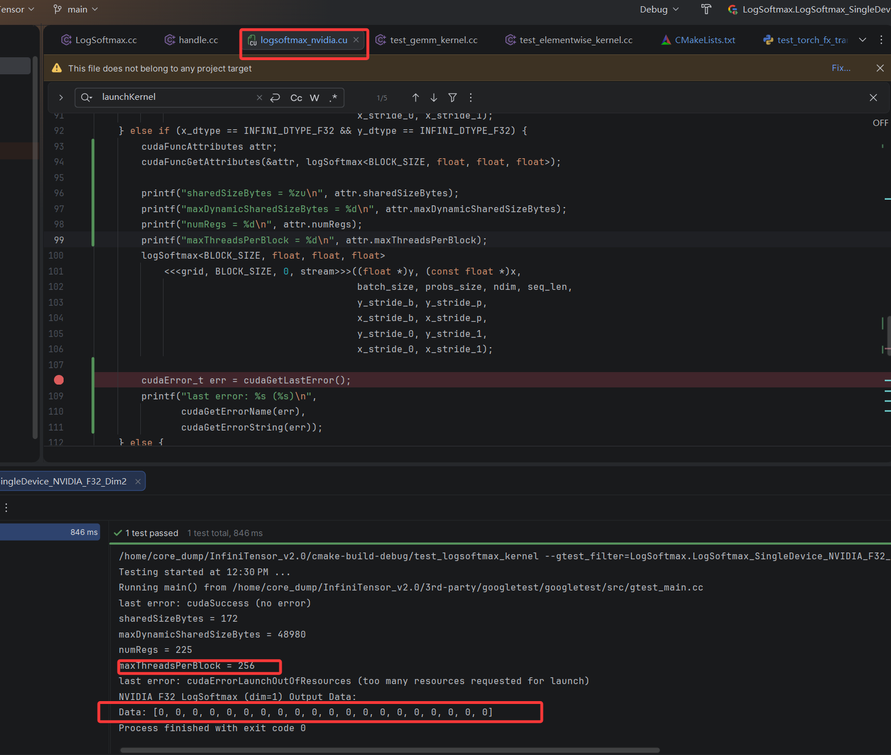

# BUGs
## 动态tensor不支持内存二次分配
触发逻辑：
1. 构建图时使用动态tensor
2. 第一次调用runtime.run 会推导内存大小，并给ouput分配内存
3. 第二次使用新的输入tensor调用同一个图的 runtime.run，内存不会二次分配，如果第一次分配的内存够用，则执行结果正确，否则会写到合法地址之外

相关代码：
1. `python/tests/test_torch_fx_translator.py::test_dynamic_matmul` 把两个测试的顺序调换就会触发(第二个测试的output所系内存大于第一个)
2. `src/core/tensor.cc` `void TensorObj::dataMalloc(const Runtime &runtime)` 

修复：
1. 修改内存分配逻辑，不再是`data == nullptr`才分配内存，内存大小不够也会重新分配

## gpu单测输入Tensor未分配内存
触发逻辑：
1. 无需任何修改，直接开启cuda跑单测即可触发
2. graph只会自动分配output的device侧内存，各种输入tensor的device侧内存需要石洞分配，而相关测试都没有分配

相关代码：
1. `test/kernels/test_elementwise_kernel.cc`
2. `test/kernels/test_gemm_kernel.cc`

修复：
1. device 是gpu时，要手动分配device侧内存，并从host拷贝数据
```c++
    // test/kernels/test_gemm_kernel.cc
    // 添加此段逻辑
    if (params.device != INFINI_DEVICE_CPU) {
        deviceA = runtime->allocDevice(A->getTotalBytes());
        deviceB = runtime->allocDevice(B->getTotalBytes());
        runtime->memcpy(deviceA, params.inputAData.data(), A->getTotalBytes(),
                        INFINIRT_MEMCPY_H2D);
        runtime->memcpy(deviceB, params.inputBData.data(), B->getTotalBytes(),
                        INFINIRT_MEMCPY_H2D);
        A->setData(deviceA);
        B->setData(deviceB);
    }
```

## gpu单测runtime单例多次initThreadContext导致内存不足
触发逻辑：
1. 无需任何修改，直接开启cuda跑单测就可触发
2. 每个单测开始都会调用`runtime->initThreadContext`,
3. 该函数只要`thread_id`不同就会申请7GB内存
4. `runtime`为单例，进程结束前，申请的内存都不会释放
5. 设备端内存两次申请就不够了

相关代码：
1. `test/kernels/test_elementwise_kernel.cc`
2. `test/kernels/test_gemm_kernel.cc`

修复：
1. 每个单测结束把申请的设备内存释放掉
```c++
    // test/kernels/test_gemm_kernel.cc
    if (params.device != INFINI_DEVICE_CPU) {
        runtime->deallocDevice(deviceA);
        runtime->deallocDevice(deviceB);
        // Also clean up output memory allocated by dataMalloc
        runtime->deallocDevice(devicePtr);
        // Clean up workspace to free GPU memory
        auto ctx = runtime->getCurrentThreadContext();
        if (ctx->workspace) {
            runtime->deallocDevice(ctx->workspace);
            ctx->workspace = nullptr;
        }
    }
```

## 申请资源太多 kernel无法启动
触发逻辑：
1. 添加`LogSoftmax` 单测过程中，发现开启cuda下，部分情况cuda计算结果为全0
2. `LogSoftmax`输入参数`x`的shape 为`[4, 5]`
3. gdb进入`src/infiniop/ops/logsoftmax/nvidia/logsoftmax_nvidia.cu:92`,发现`grid`为`(4,1,1)`, `block` 为`1024`
4. BLOCK_SIZE 太大了导致kernel启动失败，测试发现下调到256可以正常启动
```c++
    } else if (x_dtype == INFINI_DTYPE_F32 && y_dtype == INFINI_DTYPE_F32) {
        logSoftmax<BLOCK_SIZE, float, float, float>
            <<<grid, BLOCK_SIZE, 0, stream>>>((float *)y, (const float *)x,
                                              batch_size, probs_size, ndim, seq_len,
                                              y_stride_b, y_stride_p,
                                              x_stride_b, x_stride_p,
                                              y_stride_0, y_stride_1,
                                              x_stride_0, x_stride_1);

        cudaError_t err = cudaGetLastError();
        printf("last error: %s (%s)\n",
               cudaGetErrorName(err),
               cudaGetErrorString(err));
        // 此处会输出 last error: cudaErrorLaunchOutOfResources (too many resources requested for launch)
    } else {
        return INFINI_STATUS_BAD_TENSOR_DTYPE;
    }
```
